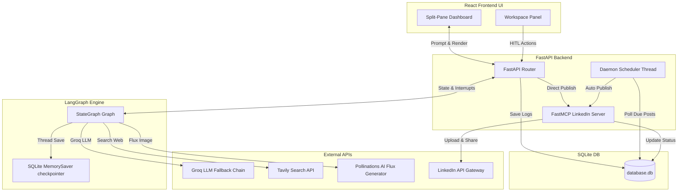
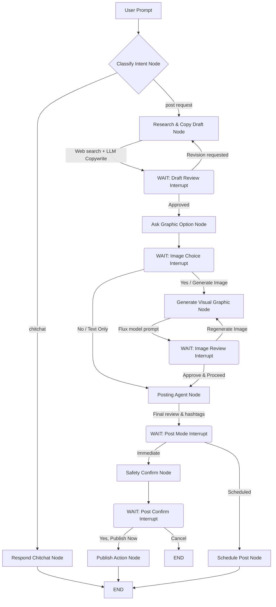

# LinkedIn Autopilot Agent Scheduler 🚀

An AI-driven LinkedIn copywriting, graphic generation, and post scheduling dashboard. Research trending topics, draft engaging copy, generate premium visual assets, and schedule or publish posts to your real LinkedIn feed—all in one unified platform.

**Live Demo Dashboard**: [https://linkedin-autopilot-frontend.onrender.com/](https://linkedin-autopilot-frontend.onrender.com/)

---

## ✨ Key Features & Engineering Highlights (Recruiter Cheat Sheet)

This project demonstrates a production-grade AI agent architecture, prioritizing stateful session management, resilience, security, and developer operations:

### 🧠 Stateful AI Workflows & Human-in-the-Loop (HITL) Controls
* **LangGraph State Machine**: Leverages a structured `StateGraph` workflow engine to orchestrate step-by-step copywriting, search, graphics generation, and scheduling pipelines.
* **Interactive Approval Gates**: Uses thread checkpointer memory (`MemorySaver`) to implement true Human-in-the-Loop (HITL) architecture. The agent pauses graph execution at critical milestones (reviewing drafts, image selection, scheduling confirmation) and resumes cleanly once the user submits their choices.
* **Contextual Copy Revisions**: Employs a specialized editor prompt (`SYSTEM_REVISION_PROMPT`) inside the drafting node. If a user rejects a draft, the node dynamically bypasses generic web search and evaluates both the existing draft and revision feedback, updating the text seamlessly.

### 🔒 Enterprise-Ready Multi-Tenant Architecture
* **Isolated User Contexts**: Refactored the database schema and query layers to support multi-user operations. Conversations, post drafts, scheduled events, and LinkedIn tokens are partitioned securely under the user's specific member URN (`user_urn` tracking).
* **Authenticated Routing**: FastAPI endpoints extract identity tokens via `X-User-URN` request headers. The React client intercepts redirect tokens on login and encapsulates all API requests within a secure session context.
* **Multi-Account Background Scheduler**: The background polling daemon thread handles multi-user job queues. It queries pending posts every 10 seconds, fetches the respective owner's publishing credentials context, and schedules API dispatches.

### 🛡️ Production-Grade API Resilience
* **Automated Key Rotation (Rate Limit Bypass)**: Implemented an active failover LLM manager that rotates through a chain of primary and fallback Groq API keys if a `429 Too Many Requests` error is encountered.
* **Token Optimization & Cost Controls**: Limits prompt token bloat by dynamically trimming Tavily search payloads to 3 results/400 characters max per snippet, and restricts LLM generation sizes (`max_tokens=1000`) to conserve API credit limits.
* **Mock Sandbox Capability**: Includes a seamless OAuth fallback mechanism, letting recruiters or developers review client features using a mock sandbox profile (John Doe) without requiring active LinkedIn client ID credentials.

### 🎨 Graphic Design Asset Pipeline
* **Flux Visual Engine**: Connects to the high-fidelity 12B parameter **Flux model** via Pollinations AI. 
* **Dynamic Prompt Enhancer**: Employs structural prompt engineering (`enhance=true`) and random URL seeding to generate clay 3D objects, modern glassmorphic card layouts, or flat vector graphics instead of generic stock photos.

### 🐳 DevOps & Cloud Infrastructure
* **Render Blueprints (`render.yaml`)**: Deploys the Python FastAPI container stack automatically using Render Blueprints.
* **Resilient Storage Fallbacks**: Uses defensive try/except handling to check write privileges. If deploying to Render's Free tier (where persistent volume disks are disabled and root-level folders are read-only), the app gracefully falls back to local workspace SQLite paths to avoid startup crashes.
* **Dockerized Workspaces**: Out-of-the-box support for multi-container coordination using Docker Compose (`docker-compose.yml`).

---

## 🏗️ System Architecture

The following diagram illustrates how the **React Frontend**, **FastAPI Backend**, **LangGraph Workflow**, **SQLite database**, and external API providers communicate:



---

## 🧠 LangGraph Workflow Architecture (HITL)

The core backend agent is built as a state machine using **LangGraph**. It utilizes conditional edges and `interrupt_after` blocks on user reviews to enable a true **Human-in-the-Loop (HITL)** experience:



### LangGraph Workflow Features:
1. **Thread Checkpointer (`MemorySaver`)**: Session history and node configurations are preserved between api calls. Resuming is as simple as calling `agent_graph.invoke(None, config=config)` after updating state.
2. **Dynamic Key Rotation**: If a Groq API key is rate-limited (`429 Too Many Requests`), the agent automatically rotates to fallback keys configured in `.env` to prevent crashes.
3. **Token Capping**:
   * Outbound generations are restricted using `max_tokens=1000`.
   * Input tokens are reduced by compressing Tavily search results to 3 items and truncating snippets to 400 characters max.

---

## 🛠️ Tech Stack
* **Frontend**: React (Vite) styled with Tailwind CSS v4 and Lucide icons.
* **Backend**: FastAPI (Python 3.10+) running async endpoints.
* **Orchestration**: LangGraph state machine.
* **AI Tool Integration**: Tavily Search (Web search) + Pollinations AI (Flux image generator) + Groq (LLM).
* **Database**: SQLite3.

---

## ⚡ Quick Start

### 1. Prerequisites
* Install [Docker & Docker Compose](https://docs.docker.com/get-docker/) (Recommended)
* Or run locally using Python 3.10+ and Node.js 18+.

### 2. Configure Environment Variables
Copy `.env.example` to `.env` in the root directory and configure:
```ini
# Tavily API Key for real-time web search
TAVILY_API_KEY=your_tavily_key

# Groq API Key and Fallbacks for model rotation
GROQ_API_KEY=your_primary_groq_key
GROQ_API_KEY_FALLBACK_1=your_fallback_groq_key_1
GROQ_API_KEY_FALLBACK_2=your_fallback_groq_key_2

# Real LinkedIn posting credentials
LINKEDIN_CLIENT_ID=your_linkedin_client_id
LINKEDIN_CLIENT_SECRET=your_linkedin_client_secret
LINKEDIN_REDIRECT_URI=http://localhost:8000/api/auth/linkedin/callback
```
*Note: If `LINKEDIN_CLIENT_ID` is left empty, the application automatically defaults to a sandbox mock login environment (John Doe profile) for local testing.*

### 3. Setting Up Real LinkedIn API Credentials
To enable real LinkedIn publishing:
1. Go to the [LinkedIn Developer Portal](https://www.linkedin.com/developers/) and sign in.
2. Click **Create App** and fill in your details.
3. In the app portal, go to the **Products** tab and request activation for:
   * **Share on LinkedIn**
   * **Sign In with LinkedIn (using OpenID Connect)**
4. In the **Auth** tab, retrieve your **Client ID** and **Client Secret**, and set the **Authorized Redirect URLs** to:
   * `http://localhost:8000/api/auth/linkedin/callback`
5. Place these values inside the `.env` file.

---

## 🐳 Running the Application

### Option A: Run with Docker (Recommended)
From the root directory, start both frontend and backend in one command:
```bash
docker-compose up --build
```
* **Frontend Dashboard**: `http://localhost:3000`
* **Backend Swagger API docs**: `http://localhost:8000/docs`

### Option B: Run Locally (Development)

#### Start FastAPI Backend & MCP Server:
```bash
cd backend
# Create and activate a virtual environment:
python -m venv .venv
source .venv/bin/activate  # On Windows: .venv\Scripts\activate

# Install requirements:
pip install -r requirements.txt

# Run the FastAPI server:
python main.py
```

#### Start Vite Frontend:
```bash
cd frontend
npm install
npm run dev
```
Open `http://localhost:5173` in your browser.

---

## 🚀 Key Implementation Features
* **Upgraded Visual Assets**: Utilizes the premium 12B **Flux** model via Pollinations AI. Prompts are automatically enhanced to generate modern clay 3D renders, sleek dark mode vectors, or premium glassmorphic UI card designs.
* **Auto-Scheduler Worker**: The background daemon worker thread checks the SQLite database every 10 seconds. When a post's `scheduled_time` is reached, it publishes the post automatically to LinkedIn.
* **Binary Image Upload**: Supports uploading local/base64-encoded visual assets to LinkedIn via the binary image stream.

---

## 🌐 Deploy to Render

We deploy the **FastAPI Backend** using the automated Blueprint [`render.yaml`](file:///c:/Users/DELL/Desktop/assignment-linkedine/render.yaml) blueprint, and deploy the **Vite React Frontend** separately as a Static Site.

### Step 1: Deploy Backend via Blueprint
1. **Push your code** to your GitHub repository.
2. Go to the [Render Dashboard](https://dashboard.render.com/) and click **New -> Blueprint**.
3. Select your repository and click **Connect**.
4. Render will parse [`render.yaml`](file:///c:/Users/DELL/Desktop/assignment-linkedine/render.yaml) and prompt you for the backend environment variables (like `TAVILY_API_KEY`, `GROQ_API_KEY`, etc.). Fill them in.
5. Click **Apply**.
6. Once the backend Web Service is live, copy its URL (e.g. `https://linkedin-autopilot-backend-xxxx.onrender.com`).

### Step 2: Deploy Frontend as Static Site
1. On the Render Dashboard, click **New -> Static Site**.
2. Select your repository and click **Connect**.
3. Configure the Static Site settings:
   * **Name**: `linkedin-autopilot-frontend`
   * **Root Directory**: `frontend`
   * **Build Command**: `npm install && npm run build`
   * **Publish Directory**: `dist`
4. Under the **Environment** tab, click **Add Environment Variable**:
   * **Key**: `VITE_API_BASE`
   * **Value**: `${YOUR_BACKEND_URL}/api` *(For example: `https://linkedin-autopilot-backend-xxxx.onrender.com/api`)*
5. Click **Create Static Site**. Render will compile and serve your frontend static dashboard.


---

### ⚠️ Render Free Plan Limitations & Workarounds

If you deploy this application under Render's **Free Plan**, you must configure the following to ensure the application behaves correctly:

#### 1. Ephemeral Database Resets
* **Problem**: Render's Free tier does not support persistent disks. This means your SQLite database (`database.db`) is stored inside the container's temporary memory. Whenever the container restarts or redeploys, **all chat history, scheduled posts, and user credentials will be cleared.**
* **Solution**: For a 100% free setup with persistence, you can deploy the backend container to **Railway** (which supports free persistent volumes), or modify the backend to connect to a free external database like neon.tech or Supabase. Alternatively, upgrade the Render backend to a **Starter Web Service** ($5/month) and uncomment the `disk:` block in [`render.yaml`](file:///c:/Users/DELL/Desktop/assignment-linkedine/render.yaml#L27-L32) to mount a persistent disk volume.

#### 2. Keeping the Post Scheduler Active (Avoiding Server Sleep)
* **Problem**: Render puts Free web services to sleep after 15 minutes of inactivity. When the container sleeps, the background scheduler thread (`run_post_scheduler`) stops running, and **scheduled posts will not publish on time**.
* **Solution**: Create a free account on [UptimeRobot](https://uptimerobot.com/) or [Cron-Job.org](https://cron-job.org/) and set up an HTTP monitor that pings your backend status endpoint (`https://your-backend.onrender.com/api/auth/linkedin/status`) every **10 to 12 minutes**. This keep-alive ping keeps your backend active 24/7 for free, allowing the background scheduler to publish scheduled posts on time!


