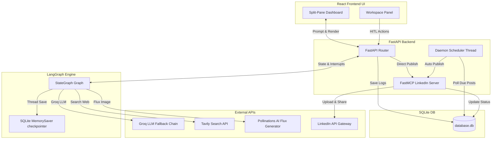
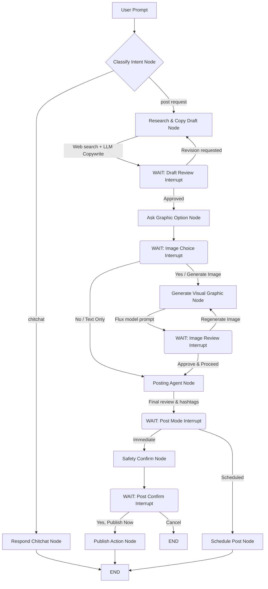

# LinkedIn Autopilot Agent Scheduler 🚀

An AI-driven LinkedIn copywriting, graphic generation, and post scheduling dashboard. Research trending topics, draft engaging copy, generate premium visual assets, and schedule or publish posts to your real LinkedIn feed—all in one unified platform.

**Live Demo Dashboard**: [https://linkedin-autopilot-frontend.onrender.com/](https://linkedin-autopilot-frontend.onrender.com/)  
**Video Demo Walkthrough**: [Google Drive Link](https://drive.google.com/file/d/1ttBlcr_xyVL7LEXDbzJMSVjcCU-JiU7E/view?usp=sharing)

---

## ✨ Key Features & Engineering Highlights

* **Stateful LangGraph Workflows**: Orchestrates post copywriting, topic research, and visual generation using stateful graph logic.
  
* **Human-in-the-Loop (HITL)**: Uses thread checkpointer interrupts to pause execution for user reviews on copy drafts, image selections, and publish approvals.
  
* **Contextual Copy Revisions**: Automatically evaluates previous drafts and user revision requests without triggering redundant web searches.
  
* **Isolated Multi-User Contexts**: Securely partitions conversations, credentials, and schedule queues by the user's LinkedIn member URN (`X-User-URN`).
  
* **Resilient Key Rotation Chain**: Automatically rotates fallback Groq API keys on rate-limit HTTP 429 errors and optimizes prompt token sizes.
  
* **Autopilot Job Scheduler**: Background daemon thread checks the SQLite queue every 10 seconds to publish scheduled posts on time.
  
* **Flux Visuals Pipeline**: Generates flat vector graphics, clay 3D objects, or modern glassmorphic cards using enhanced Flux prompts and dynamic seeding.
  
* **DevOps Ready**: Out-of-the-box Render Blueprint config (`render.yaml`) and Docker Compose scripts for containerized hosting.


---

## 🔄 Example Agent Workflow (Step-by-Step)

The following sequence describes the logical path of a single post creation workflow inside the platform:

1. **User Request**: The user enters a topic in the chat (e.g. *"Draft a post explaining LangGraph checkpoints"*).

2. **Topic Research**: The agent initiates a Tavily search query, gathering live documentation, release logs, or news summaries.

3. **Drafting Copy**: The agent passes the research payload to the LLM (prioritizing `openai/gpt-oss-120b` with fallbacks) to write a hook-structured LinkedIn post. The workflow halts on a LangGraph interrupt gate.

4. **Draft Review (Human-in-the-Loop)**:
   * **Rejection**: If the user submits revision feedback (e.g., *"Make it more engaging"*), the graph routes back to the draft node. The agent evaluates the previous draft context, generates an updated version, and halts again for approval.
   * **Approval**: The user approves the draft copy, resuming the graph.

5. **Image Choice**: The agent prompts the user to select if they want a graphic image to accompany the post.
   * If yes, the agent synthesizes a visual description prompt, calls the **Flux generator**, renders the clay 3D or glassmorphic layout, and halts for visual approval.

6. **Publishing Option**: Once the copy and visual assets are confirmed, the user chooses between **Immediate** publishing or **Scheduled** release.

7. **Execution**:
   * **Immediate**: The post is sent directly to the LinkedIn API and is live instantly.
   * **Scheduled**: The post is added to the SQLite queue with a future ISO timestamp. The backend daemon scheduler detects the entry and dispatches it to the LinkedIn API at the correct time.
     
---

## 🏗️ System Architecture

The following diagram illustrates how the **React Frontend**, **FastAPI Backend**, **LangGraph Workflow**, **SQLite database**, and external API providers communicate:



---

## 🧠 LangGraph Workflow Architecture (HITL)

The core backend agent is built as a state machine using **LangGraph**. It utilizes conditional edges and `interrupt_after` blocks on user reviews to enable a true **Human-in-the-Loop (HITL)** experience:



### LangGraph Workflow Features:
1. **Thread Checkpointer (`MemorySaver`)**: Session history and node configurations are preserved between api calls. Resuming is as simple as calling `agent_graph.invoke(None, config=config)` after updating state.
2. **Dynamic Key Rotation**: If a Groq API key is rate-limited (`429 Too Many Requests`), the agent automatically rotates to fallback keys configured in `.env` to prevent crashes.
3. **Token Capping**:
   * Outbound generations are restricted using `max_tokens=1000`.
   * Input tokens are reduced by compressing Tavily search results to 3 items and truncating snippets to 400 characters max.

---

## 🛠️ Tech Stack
* **Frontend**: React (Vite) styled with Tailwind CSS v4 and Lucide icons.
* **Backend**: FastAPI (Python 3.10+) running async endpoints.
* **Orchestration**: LangGraph state machine.
* **AI Tool Integration**: Tavily Search (Web search) + Pollinations AI (Flux image generator) + Groq (LLM).
* **Database**: SQLite3.

---

## ⚡ Quick Start

### 1. Prerequisites
* Install [Docker & Docker Compose](https://docs.docker.com/get-docker/) (Recommended)
* Or run locally using Python 3.10+ and Node.js 18+.

### 2. Configure Environment Variables
Copy `.env.example` to `.env` in the root directory and configure:
```ini
# Tavily API Key for real-time web search
TAVILY_API_KEY=your_tavily_key

# Groq API Key and Fallbacks for model rotation
GROQ_API_KEY=your_primary_groq_key
GROQ_API_KEY_FALLBACK_1=your_fallback_groq_key_1
GROQ_API_KEY_FALLBACK_2=your_fallback_groq_key_2

# Real LinkedIn posting credentials
LINKEDIN_CLIENT_ID=your_linkedin_client_id
LINKEDIN_CLIENT_SECRET=your_linkedin_client_secret
LINKEDIN_REDIRECT_URI=http://localhost:8000/api/auth/linkedin/callback
```
*Note: If `LINKEDIN_CLIENT_ID` is left empty, the application automatically defaults to a sandbox mock login environment (John Doe profile) for local testing.*

### 3. Setting Up Real LinkedIn API Credentials
To enable real LinkedIn publishing:
1. Go to the [LinkedIn Developer Portal](https://www.linkedin.com/developers/) and sign in.
2. Click **Create App** and fill in your details.
3. In the app portal, go to the **Products** tab and request activation for:
   * **Share on LinkedIn**
   * **Sign In with LinkedIn (using OpenID Connect)**
4. In the **Auth** tab, retrieve your **Client ID** and **Client Secret**, and set the **Authorized Redirect URLs** to:
   * `http://localhost:8000/api/auth/linkedin/callback`
5. Place these values inside the `.env` file.

---

## 🐳 Running the Application

### Option A: Run with Docker (Recommended)
From the root directory, start both frontend and backend in one command:
```bash
docker-compose up --build
```
* **Frontend Dashboard**: `http://localhost:3000`
* **Backend Swagger API docs**: `http://localhost:8000/docs`

### Option B: Run Locally (Development)

#### Start FastAPI Backend & MCP Server:
```bash
cd backend
# Create and activate a virtual environment:
python -m venv .venv
source .venv/bin/activate  # On Windows: .venv\Scripts\activate

# Install requirements:
pip install -r requirements.txt

# Run the FastAPI server:
python main.py
```

#### Start Vite Frontend:
```bash
cd frontend
npm install
npm run dev
```
Open `http://localhost:5173` in your browser.

---

