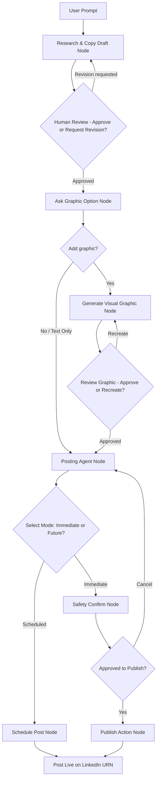

# LinkedIn Agent Post Scheduler Specification

## Why (Problem Statement)
Currently, publishing a post to LinkedIn requires navigating to the platform, manually writing the content, uploading and attaching any media (photos/images), and publishing. This manual process is time-consuming and lacks automation or scheduling capabilities.

## What (Proposed Solution)
We are building a system where users have their own AI Agent capable of drafting, refining, scheduling, and publishing posts on LinkedIn.

### Core Agent Features
* **Web Search**: The agent can perform web searches on a specified topic to gather current information.
* **Drafting**: The agent drafts engaging posts based on the researched topics.
* **Human-in-the-Loop (HITL)**: Keeps the user in control by presenting drafts for feedback and approval.
* **LinkedIn Publishing**: Once the user approves and finalizes the draft, the agent publishes or schedules the post.

---

## Functional Requirements (Implemented)

1. **User Chat Interface**: A clean UI for conversing with the agent.
2. **Sidebar**: A collapsible navigation sidebar to view and switch between different post/chat conversations, toggleable via `showSidebar` state and expand `[+]` / collapse `[X]` buttons.
3. **Message Input Area**: Located at the bottom of the chat interface for user inputs.
4. **Agent Thinking & Research**: The agent displays its thinking process, performs research using search tools, and produces a draft.
5. **Iterative Refinement**: If the user is unsatisfied with the draft, the agent performs further research and revises the post.
6. **LinkedIn Posting**: Upon receiving user approval, the agent publishes the post to LinkedIn.
7. **Schedule & Delete**: The agent has tool access to schedule posts for later and delete scheduled/existing posts.
8. **Image Generation Prompting**: Before final publishing, the agent asks if the user wants to generate an image. If yes, an image-generation agent generates the graphic (via Pollinations AI), binds it to the text post, and sends it to the posting agent.
9. **Premium Split-Pane UI Layout**:
   - **Left Pane**: Text message bubbles, thinking logs, and prompt inputs.
   - **Right Pane**: Workspace card displaying the active post copywriting draft, visual image, and stateful workflow control buttons.
10. **Sandbox/Mock Authorization Mode**: Bypasses real OAuth connection when environment keys are empty, logging in a demo profile (John Doe) and enabling local sandbox post testing.

---

## Constraints

1. **Performance**: The system responds within seconds.
2. **Concurrency**: Persistent thread checkpointer via LangGraph's `MemorySaver`.
3. **Robustness**: High-quality error-handling mechanisms throughout.
4. **OOP Style**: Backend agent code is written in an Object-Oriented Programming (OOP) manner using class components.

---

## Technology Stack

* **Frontend**: React (Vite) styled with Vanilla CSS and Tailwind CSS v4 (using `@tailwindcss/postcss` compiler integration).
* **Backend**: FastAPI (leveraging async capabilities) running on Python 3.12 virtual environment.
* **Agent Framework**: LangGraph with state routing nodes and `interrupt_after` blocks.
* **MCP Integration**: FastMCP for building the LinkedIn MCP server.
* **Web Search**: Tavily Search API.

---

## Folder Structure

```text
linkedin-agent-scheduler/
├── docker-compose.yml
├── .gitignore
├── README.md
├── spec.md
├── frontend/
│   ├── package.json
│   ├── vite.config.js
│   ├── postcss.config.js
│   ├── src/
│   │   ├── main.jsx
│   │   ├── App.jsx
│   │   ├── index.css
│   │   ├── components/
│   │   └── assets/
│   └── public/
└── backend/
    ├── main.py
    ├── database.py
    ├── requirements.txt
    ├── .env
    ├── Dockerfile
    └── agent/
        ├── schemas/
        │   └── schemas.py # Pydantic data validation models
        ├── tools/
        │   └── tools.py   # Tavily search & LinkedIn integration tools
        ├── prompts/
        │   └── prompt.py  # Agent system and instruction prompts
        ├── nodes/
        │   └── node.py    # LangGraph agent state/node execution logic
        └── workflow/
            └── workflow.py # LangGraph workflow graph definition
```

---

## System Flow & State Graph (Implemented)



### LangGraph Stateful Logic
The state machine is persistent using thread configuration:
- Pauses execution flow using `interrupt_after` blocks on user reviews.
- Backend resumes execution by calling `agent_graph.invoke(None, config=config)` after client state updates.
- SQLite is utilized to persist chat logs, titles, and publication history.

---

## Backend Implementation Steps & Reference

This section serves as a step-by-step history of all backend core components and files built:

### 1. Persistent SQLite Database (`database.py`)
- Created `DatabaseManager` using Python's standard `sqlite3` driver.
- Formulated table schemas:
  - `chat_conversations`: Tracks conversation threads, titles, and creation times.
  - `chat_messages`: Stores message records with roles (`user`, `assistant`), message text content, agent thinking logs, and bound visual image URLs.
  - `linkedin_posts`: Records local copy drafts, status (`scheduled`, `published`, `failed`), scheduling timestamps, and remote LinkedIn publication URNs.
  - `linkedin_credentials`: Stores real encrypted access tokens, Member URN profiles, and profile picture avatar URLs securely.
- Programmed dialogue logging pointers: Rather than saving full text-draft duplicates in chat dialogues, the api saves pointer messages ("I have generated a post copy, please review on the right..."), keeping the UI scroll feed clear.

### 2. State-Driven Agent State Graph (`backend/agent/`)
- **State Definition (`state/state.py`)**: Defined state keys to record graph progress including `approval_status`, `image_needed`, `image_approved`, `post_mode`, `post_confirmed`, and `posting_result`.
- **Node Execution Logic (`nodes/node.py`)**: Implemented class components to execute active nodes:
  - `research_and_draft`: Invokes Tavily web search tool to retrieve content and drafts the post using Groq LLM.
  - `ask_image_option`: Interactive wait state asking if graphics are desired.
  - `generate_image`: Connects to Pollinations AI to fetch relevant themed visual graphics.
  - `posting_agent`: Prompts the user to choose between immediate or scheduled posting.
  - `confirm_posting_prompt`: A final safety prompt confirming permission to publish.
- **Workflow Router Graph (`workflow/workflow.py`)**: Compiled the `StateGraph` using memory checkpointer `MemorySaver()`, conditional edges, and `interrupt_after` parameters on all decision points.

### 3. REST API Routes (`main.py`)
- **FastAPI Endpoints**:
  - `/api/chat`: Primary endpoint that saves dialogue, determines whether to start a new LangGraph or resume an interrupted thread, and returns graph state.
  - `/api/conversations` & `/api/posts`: Operations to list histories, load specific threads, and delete items.
- **LinkedIn OAuth**:
  - `/api/auth/linkedin`: Generates auth URLs.
  - `/api/auth/linkedin/callback`: Exchanges tokens with LinkedIn, retrieves user profiles from `api.linkedin.com/v2/userinfo`, and saves them to database.
  - `/api/auth/linkedin/status` & `/api/auth/linkedin/disconnect`: Manages live status feeds.

### 4. Background Post Scheduler Thread (`main.py`)
- Configured a daemon thread (`run_post_scheduler`) that checks the database table every 10 seconds.
- When current time passes a post's `scheduled_time`, the scheduler pulls the credentials and invokes the LinkedIn publishing tool to make it live automatically.

### 5. Sandbox / Mock Fallback Routing
- Integrated mock routing callback `/api/auth/linkedin/mock` when local `.env` keys are empty.
- Configured mock publishing hooks in `fastmcp_linkedin.py` so that sandbox posts record successfully without raising errors.

